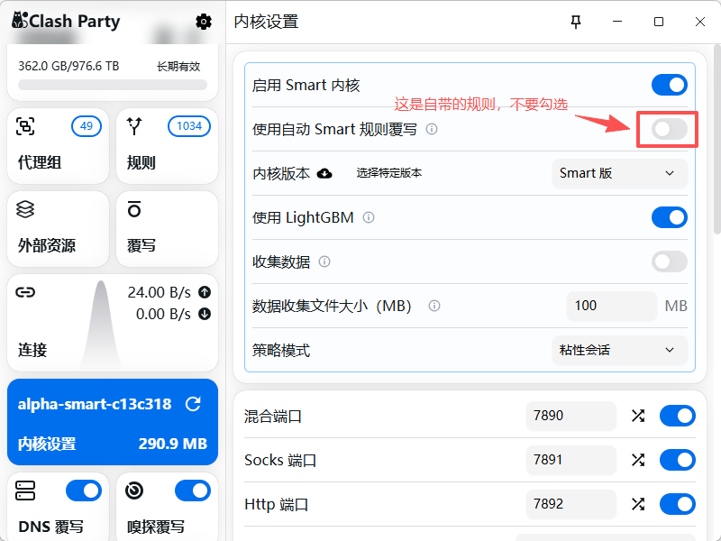

# 来源
https://github.com/IvanSolis1989/Smart-Config-Kit

# Clash Party Custom Override

这个仓库会定时拉取上游 `ClashParty(mihomo-smart).js`，把 `custom-pre-rules.js` 里的自定义规则插入到 `function injectRules(config) { config.rules = [` 的最前面，然后生成 Clash Party 可导入的 JS 覆写文件。

## 使用方法

1. 修改 `custom-pre-rules.js`，维护你自己的前置规则。
2. 推送到 GitHub。
3. 打开 GitHub 仓库的 `Actions`，手动运行一次 `Update Clash Party Override`。
4. 在 Clash Party 覆写页面导入下面这个 Raw 地址：

```text
https://raw.githubusercontent.com/xiaoksks/Smart-Clash-Party-Override/main/dist/Smart-Override.js
```

也可以使用 jsDelivr：

```text
https://cdn.jsdelivr.net/gh/xiaoksks/Smart-Clash-Party-Override@main/dist/Smart-Override.js
```

## 本地生成

```bash
npm run build
```

生成文件：

```text
dist/Smart-Override.js
```

## 更新频率

GitHub Actions 默认每天北京时间 12:20 自动拉取上游并重新生成。如果上游没有变化，Action 不会产生新提交。



## 一、安装客户端

### Mihomo Party（推荐）
- 开源地址：https://github.com/mihomo-party-org/mihomo-party/releases
- 支持 Windows / macOS (Intel + Apple Silicon) / Linux (deb/rpm/AppImage)
- 特性：**内置 Smart 内核**，默认开启 TUN，UI 中直接支持 JS 覆写。

### Clash Verge Rev
- 开源地址：https://github.com/clash-verge-rev/clash-verge-rev/releases
- 需要在「设置 → Clash 内核」中切换到 **Mihomo Alpha**（Smart 内核当前仍在 Alpha 分支）。

---

## 二、准备订阅

### 场景 A：单机场订阅
直接在客户端「订阅（Subscriptions / Profiles）」中添加机场链接即可，脚本会自动识别并分类节点。

### 场景 B：多机场融合（推荐，脚本原生针对此优化）
本脚本**针对 Sub-Store 环境做了大量优化**，强烈建议搭配使用：

1. 自建或使用公共 **Sub-Store**（https://github.com/sub-store-org/Sub-Store）。
2. 在 Sub-Store 中添加 2–N 个机场作为「单条订阅」。
3. 新建一个「**组合订阅**」或「**远程订阅**」，聚合所有机场。
4. 生成一个 **Clash (Mihomo)** 格式的订阅 URL。
5. 将该 URL 粘贴到客户端的订阅中。

脚本会自动为所有节点：
- 剔除信息类节点（导航/流量/到期/官网…）
- 剔除高倍率节点（10x/20x/100x）
- 按地区/城市/IATA 代码/ISO 代码**多维度分类**到 22 区域组（11 全部 + 11 家宽）

### 场景 C：在线订阅转换站（备选方案）

如果你同时买了多家机场，也可以用**在线订阅转换站**把多个链接合并成一个 URL，无需安装任何工具。

1. 打开 https://acl4ssr-sub.github.io （或 https://sub.v1.mk）
2. 把多家机场订阅链接粘贴进去（一行一个或用 `|` 分隔）
3. 后端选 **Mihomo（Clash.Meta）**
4. 生成新 URL → 填入客户端「订阅」输入框

> ⚠️ **隐私提醒**：转换站能看到你提交的订阅链接（含 token）。不要提交含专线 IP 等敏感信息的订阅链接。
>
> **Clash Party 的 Sub-Store 是内置方案**：Clash Party / Clash Verge Rev / Mihomo Party 原生集成了 Sub-Store 插件（方式 B），无需额外安装。**优先用场景 B（Sub-Store）**，转换站仅作为没有 Sub-Store 环境时的备选。

---

## 三、导入覆写脚本（核心步骤）

### Mihomo Party

1. 左侧菜单 → **覆写（Override）** → 右上角 ➕。
2. 类型选择 **JavaScript（.js）**。
3. 名称：`Clash Smart v5.4.12` 或 `Clash Normal v5.4.12`（根据你粘贴的那份）。
4. 内容：复制 `Clash Party/ClashParty(mihomo-smart).js` **或** `Clash Party/ClashParty(mihomo).js` 的**全文**粘贴进去（两份脚本都在 2200+ 行左右）。
5. 保存。
6. 返回「订阅」页面，右键你的订阅 → **编辑** → **启用覆写** → 勾选刚才的脚本 → 保存（**只勾一份**，不要同时启用）。
7. 切换到该订阅，点击「**连接**」。

### Clash Verge Rev

1. 左侧 → **脚本（Scripts）** → ➕ **新建脚本** → **本地脚本**。
2. 粘贴 `.js` 全部内容，保存。
3. **订阅（Profiles）** → 右上角 ⋯ → **扩展管理（Extensions）** → 勾选刚才的脚本。
4. 重启内核（Ctrl/Cmd + R）。

---

## 四、粘贴 UI 补充配置

脚本会写入 **proxies / proxy-groups / rules / DNS** 主体配置；但不同 GUI 仍可能用 UI Mixin 覆盖 DNS / Sniffer / GeoX URL。为避免客户端侧覆盖掉 v5.4.17 DNS 合同，建议把下方内容同步粘贴到客户端的 **外部数据、DNS、嗅探覆写中**：

GeoX URL：


```yaml
geox-url:
  geoip: https://fastly.jsdelivr.net/gh/Loyalsoldier/geoip@release/geoip.dat
  mmdb: https://fastly.jsdelivr.net/gh/Loyalsoldier/geoip@release/Country.mmdb
  asn: https://fastly.jsdelivr.net/gh/Loyalsoldier/geoip@release/GeoLite2-ASN.mmdb
  geosite: https://fastly.jsdelivr.net/gh/MetaCubeX/meta-rules-dat@release/geosite.dat
geo-auto-update: true
```

DNS：


```yaml
dns:
  use-hosts: false
  use-system-hosts: false
  respect-rules: true
  prefer-h3: false
  default-nameserver:
    - 223.5.5.5
    - 119.29.29.29
    - 1.1.1.1
    - 8.8.8.8
  nameserver:
    - https://dns.alidns.com/dns-query
    - https://doh.pub/dns-query
  proxy-server-nameserver:
    - https://cloudflare-dns.com/dns-query
    - https://dns.google/dns-query
    - https://dns.alidns.com/dns-query
    - https://doh.pub/dns-query
  direct-nameserver:
    - https://dns.alidns.com/dns-query
    - https://doh.pub/dns-query
  fallback:
    - https://cloudflare-dns.com/dns-query
    - https://dns.google/dns-query
  fallback-filter:
    geoip: true
    geoip-code: CN
    geosite:
      - gfw
      - geolocation-!cn
    ipcidr:
      - 240.0.0.0/4
      - 0.0.0.0/32
      - 127.0.0.0/8
      - 10.0.0.0/8
      - 192.168.0.0/16
    domain: []
```

Sniffer：


```yaml
sniffer:
  enable: true
  parse-pure-ip: true
  force-dns-mapping: true
  override-destination: true
  sniff:
    HTTP:
      ports:
        - "80"
        - 8080-8880
      override-destination: true
    TLS:
      ports:
        - "443"
        - "8443"
    QUIC:
      ports:
        - "443"
        - "8443"
        - "4433"
```

---

